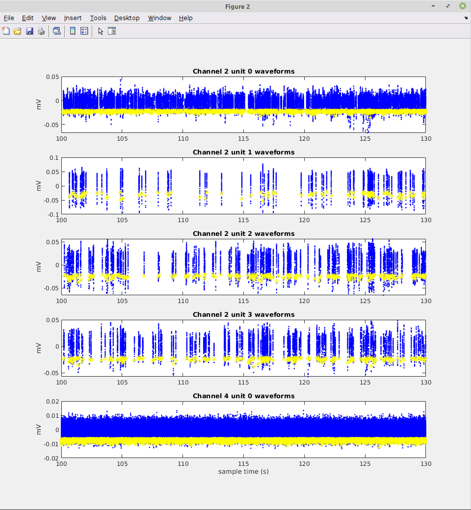
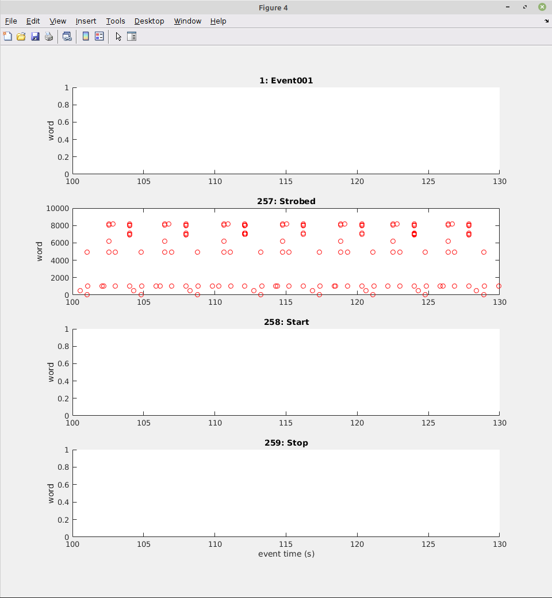

# plx-to-kilosort
A bit of Matlab code to convert Plexon `.plx` files into formats we can pass to Kilosort and/or Phy.

You can run this code locally and/or in containers.

# Containers

Two container images are produced from this repo and shared on Docker Hub:
 - [ninjaben/plx-to-kilosort](https://hub.docker.com/repository/docker/ninjaben/plx-to-kilosort/general) converts a Plexon `.plx` file to a raw `.bin` file, plus Kilosort "ops" and "chanMap" files, in both '.mat' and '.json' format for convenience.  The results of this step can be passed on to Kilosort for sorting.
 - [ninjaben/plx-to-phy](https://hub.docker.com/repository/docker/ninjaben/plx-to-phy/general) can take the `.plx`, `.bin`, and "ops" produced above and convert directly to "Phy" format.  This allows review and curation of spike sorting results that were performed manually with Plexon and saved in the `.plx` file.  This is intended to allow comparison of manual and automatic spike sorting using the same Phy tool.

Here are some example Docker commands for running these in containers.

## Conversion of `.plx` file to `.bin` and "ops"
This step uses Matlab inside the container.

```
LICENSE_MAC_ADDRESS=$(cat /sys/class/net/en*/address)
LICENSE_FILE="$(pwd)/license.lic"
sudo docker run --rm \
  --mac-address "$LICENSE_MAC_ADDRESS" \
  --volume $LICENSE_FILE:/licenses/license.lic \
  --env MLM_LICENSE_FILE=/licenses/license.lic \
  --volume "/path/to/my/plexon/data:/plexon/data" \
  ninjaben/plx-to-kilosort:v0.0.13 \
  -batch "[chanMapFile, binFile, opsFile] = plxToKilosort('/plexon/data/recording.plx', '/plexon/data/out', 'tRange', [0, 30], 'ops', {'fproc', '/plexon/data/scratch/temp_wh2.dat'})"
```

## Conversion of `.plx`,`.bin`, and "ops" to Phy
This step uses [spikeinterface](https://github.com/SpikeInterface/spikeinterface) and [Jupyter](https://jupyter-notebook.readthedocs.io/en/latest/).

### batch mode

```
sudo docker run --rm \
  --volume "/path/to/my/plexon/data:/plexon/data" \
  --env PLX_FILE="/plexon/data/recording.plx" \
  --env BIN_FILE="/plexon/data/out/recording.plx.bin" \
  --env OPS_FILE="/plexon/data/out/recording-ops.json" \
  --env OUT_DIR="/plexon/data/out/" \
  ninjaben/plx-to-phy:v0.0.13  \
  jupyter nbconvert --execute /home/jupyter/notebooks/plx_to_phy.ipynb --to html"
```

### interactive mode

```
sudo docker run --rm \
  --volume "/path/to/my/plexon/data:/plexon/data" \
  --network=host \
  ninjaben/plx-to-phy:v0.0.13  \
  "jupyter notebook"
```

Then visit [localhost:8888](http://localhost:8888).

# Without Containers

## Matlab setup

The code in the `plx-to-kilosort/matlab` folder can be run locally in Matlab.  To run it locally you need to insteall a dependency -- the Plexon [OmniPlex and MAP Offline SDK Bundle](https://plexon.com/wp-content/uploads/2017/08/OmniPlex-and-MAP-Offline-SDK-Bundle_0.zip).
This is available from the [Plexon Software Downloads](https://plexon.com/software-downloads/#software-downloads-SDKs) page (accessed December 2022).

Once you have the OmniPlex and MAP Offline SDK Bundle:

 - Unzip it.
 - Find `Matlab Offline Files SDK.zip` within.
 - Unzip that, too.
 - Add `OmniPlex and MAP Offline SDK Bundle` with subfolders to your Matlab path.
 - In Matlab, execute `build_and_verify_mexPlex` to compile the `mexPlex` function.

Once that works, add `plx-to-kilosort/matlab` to your Matlab path and you should be ready to proceed.

## Summarize `.plx` File in Matlab

We can summarize the contents of a Plexon `.plx` file with `summarizePlxFile.m`.  This will return some `header` info and `counts` for data channels including spikes and timestamps, continuous AD "slow" channels, and digital events.

For example, to summarize 30 seconds of data starting at 100s:

```
>> [header, counts] = summarizePlxFile(plxFile, 100, 30);

Timestamps and waveforms:
  113101 timestamps for spike channel 2, unit 0
  58887 timestamps for spike channel 2, unit 1
  449384 timestamps for spike channel 4, unit 0
  113101 waveforms for spike channel 2, unit 0
  58887 waveforms for spike channel 2, unit 1
  449384 waveforms for spike channel 4, unit 0
Digital events:
  1 events for event channel 1 -- Event001 
  40351 events for event channel 257 -- Strobed  
  1 events for event channel 258 -- Start    
  1 events for event channel 259 -- Stop     
AD channels:
  3423016 samples for continuous / slow channel 17 -- AD18 
  3423016 samples for continuous / slow channel 47 -- AD48 
  3423016 samples for continuous / slow channel 48 -- Pupil
  3423016 samples for continuous / slow channel 49 -- X    
  3423016 samples for continuous / slow channel 50 -- Y    
  3423016 samples for continuous / slow channel 51 -- AD52 
```

We get Plexon header-level data:

```
>> header

header = 

  struct with fields:

                  file: 'myData.plx'
               version: 107
             frequency: 40000
               comment: ''
            trodalness: 1
         pointsPerWave: 50
    pointsPreThreshold: 8
            spikePeakV: 3000
           spikeAdBits: 12
             slowPeakV: 5000
            slowAdBits: 12
              duration: 3.423013875000000e+03
              dateTime: ' 8/ 5/2022 12: 2:30'

```

We get counts of spike timestamps and waveforms, ad samples, and digital events:

```
>> counts

counts = 

  struct with fields:

      tscounts: [27×17 double]
      wfcounts: [27×17 double]
      evcounts: [1 0 0 0 0 0 0 0 0 0 0 0 0 0 0 0 40351 1 1 0 0 0 0 0 0 0 0 0]
    contcounts: [0 0 0 0 0 0 0 0 0 0 0 0 0 0 0 0 0 3423016 0 0 0 0 0 0 0 0 0 0 0 0 0 0 0 0 0 0 0 0 0 0 0 0 0 0 0 0 0 3423016 3423016 3423016 3423016 3423016 0 0 0 0 0 0 0 0 0 0 0 0]
```

We also get four plots, each showing a different channel type over the requested `startTime` and `duration`.  Some examples are below.

### Spike channel Waveforms over time



### Spike channel Waveforms aligned in the trigger window


### Continuous AD AKA "slow" channels


### Digital event channels



## Spikeinterface and Jupyter Setup

The code in the `plx-to-phy/matlab` folder can be run locally in a Jupyter notebook.  A straightforward way to do all the setup is:

 - [Install conda](https://docs.conda.io/projects/conda/en/latest/user-guide/install/index.html#) on your machine.
 - Go to the command line, `cd` to the `plx-to-phy` folder of this repo, and run the following:

```
conda env create -f environment.yml
conda activate si_env
```

From there you should be able to run the notebook in batch mode or interactively.

### batch mode

```
PLX_FILE="/path/to/my/plexon/data/recording.plx" \
BIN_FILE="/path/to/my/plexon/data/out/recording.plx.bin" \
OPS_FILE="/path/to/my/plexon/data/recording-ops.json" \
OUT_DIR="/path/to/my/plexon/data/out/" \
jupyter nbconvert --execute plx_to_phy.ipynb --to html
```

### interactive mode

```
jupyter notebook
```

Then visit [localhost:8888](http://localhost:8888).
