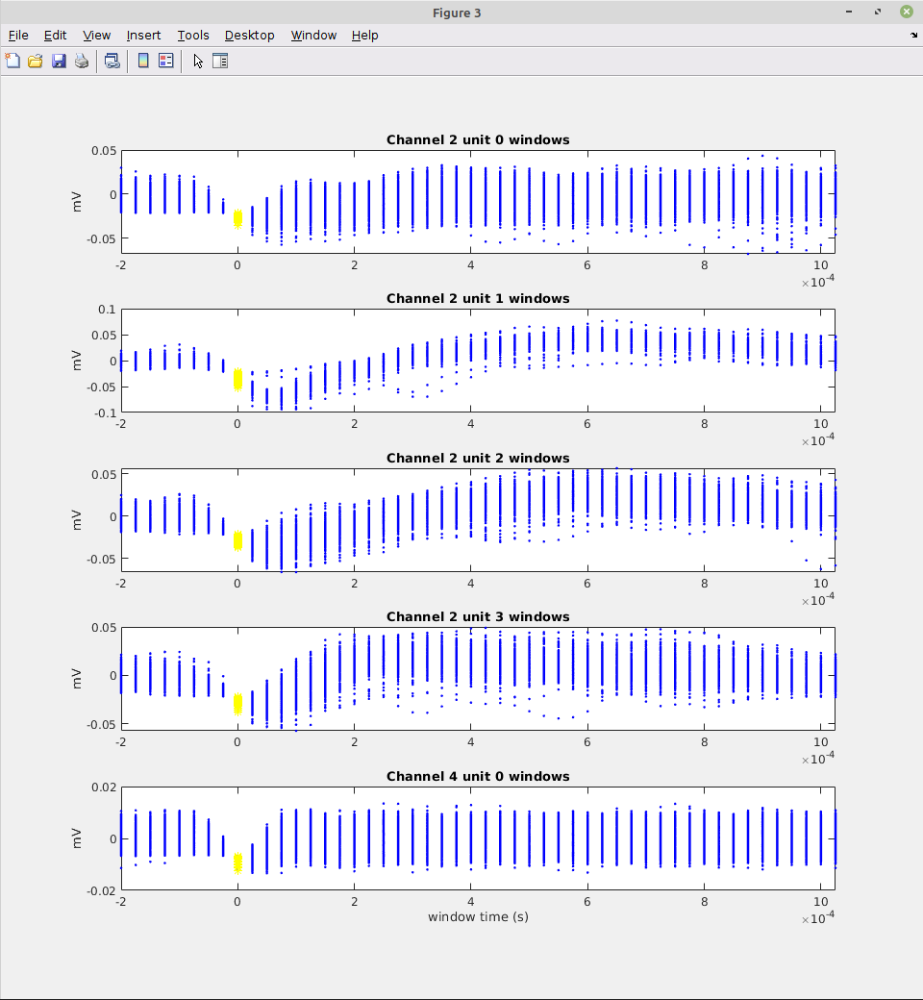
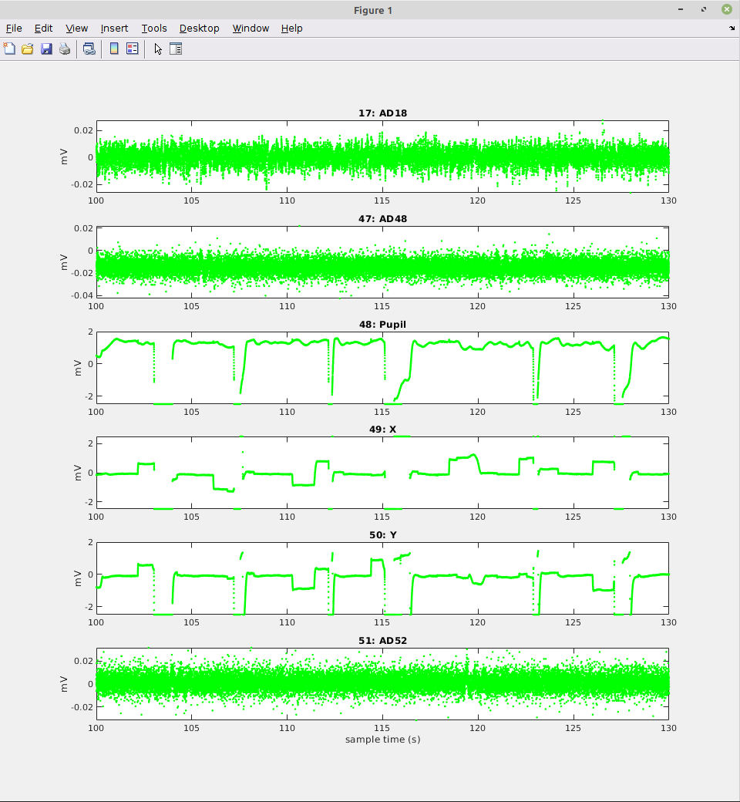

# plx-to-kilosort
A bit of Matlab code to convert Plexon `.plx` files into something we can pass into kilosort

# Dependency

This code depends on the Plexon [OmniPlex and MAP Offline SDK Bundle](https://plexon.com/wp-content/uploads/2017/08/OmniPlex-and-MAP-Offline-SDK-Bundle_0.zip).
This is available from the [Plexon Software Downloads](https://plexon.com/software-downloads/#software-downloads-SDKs) page (accessed December 2022).

Once you have the OmniPlex and MAP Offline SDK Bundle:

 - Unzip it.
 - Find `Matlab Offline Files SDK.zip` within.
 - Unzip that, too.
 - Add `OmniPlex and MAP Offline SDK Bundle` with subfolders to your Matlab path.
 - In Matlab, execute `build_and_verify_mexPlex` to compile the `mexPlex` function.

Once that works, you should be ready to proceed.

# Summarize `.plx` File

We can summarize the contents of a Plexon `.plx` file with `summarizePlxFile.m`.  This will return some `header` info and `counts` for data channels including spikes and timestamps, continuous AD "slow" channels, and digital events.

For example, to summarize 30 seconds of data starting at 100s:

```
>> [header, counts] = summarizePlxFile(plxFile, 100, 30);

Timestamps and waveforms:
  113101 timestamps for spike channel 2, unit 0
  58887 timestamps for spike channel 2, unit 1
  449384 timestamps for spike channel 4, unit 0
  113101 waveforms for spike channel 2, unit 0
  58887 waveforms for spike channel 2, unit 1
  449384 waveforms for spike channel 4, unit 0
Digital events:
  1 events for event channel 1 -- Event001 
  40351 events for event channel 257 -- Strobed  
  1 events for event channel 258 -- Start    
  1 events for event channel 259 -- Stop     
AD channels:
  3423016 samples for continuous / slow channel 17 -- AD18 
  3423016 samples for continuous / slow channel 47 -- AD48 
  3423016 samples for continuous / slow channel 48 -- Pupil
  3423016 samples for continuous / slow channel 49 -- X    
  3423016 samples for continuous / slow channel 50 -- Y    
  3423016 samples for continuous / slow channel 51 -- AD52 
```

We get Plexon header-level data:

```
>> header

header = 

  struct with fields:

                  file: 'myData.plx'
               version: 107
             frequency: 40000
               comment: ''
            trodalness: 1
         pointsPerWave: 50
    pointsPreThreshold: 8
            spikePeakV: 3000
           spikeAdBits: 12
             slowPeakV: 5000
            slowAdBits: 12
              duration: 3.423013875000000e+03
              dateTime: ' 8/ 5/2022 12: 2:30'

```

We get counts of spike timestamps and waveforms, ad samples, and digital events:

```
>> counts

counts = 

  struct with fields:

      tscounts: [27×17 double]
      wfcounts: [27×17 double]
      evcounts: [1 0 0 0 0 0 0 0 0 0 0 0 0 0 0 0 40351 1 1 0 0 0 0 0 0 0 0 0]
    contcounts: [0 0 0 0 0 0 0 0 0 0 0 0 0 0 0 0 0 3423016 0 0 0 0 0 0 0 0 0 0 0 0 0 0 0 0 0 0 0 0 0 0 0 0 0 0 0 0 0 3423016 3423016 3423016 3423016 3423016 0 0 0 0 0 0 0 0 0 0 0 0]
```

We also get four plots, each showing a different channel type over the requested `startTime` and `duration`.  Some examples are below.

## Spike channel Waveforms over time


## Spike channel Waveforms aligned in the trigger window



## Continuous AD AKA "slow" channels



## Digital event channels


